# EXTRACT_FROM_PTU_FLIM
This script allows us to extract raw data from the PTU files, filter the data using time gating, or apply statistical filters based on the fluorescence decay pattern.

## HOW TO USE

To run the script, type in the command line:   
    
    'python EXTRACT_FROM_PTU_FLIM.py'
It will start a graphical interface that will help to navigate through the process of filtering.    
Next, click File and Open the file directory to select the folder where you store your selected _.ptu_ files.    

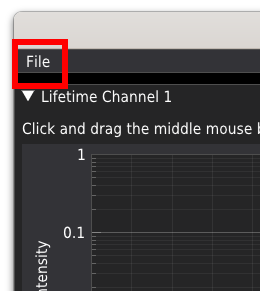

It is suggested to keep the _.ptu_ from different experiments in separate folders.    
The script recognizes the mode in which the measurement was performed (standard or PIE). If two detectors are used in the measurement, the signal will be automatically split and displayed as Channel 1 and Channel 2. The lifetime analysis can be performed for each channel separately.     

Simple time gating can be realized by selecting the region of the fluorescence decay pattern by moving the orange and red drag lines displayed in the upper plots.    

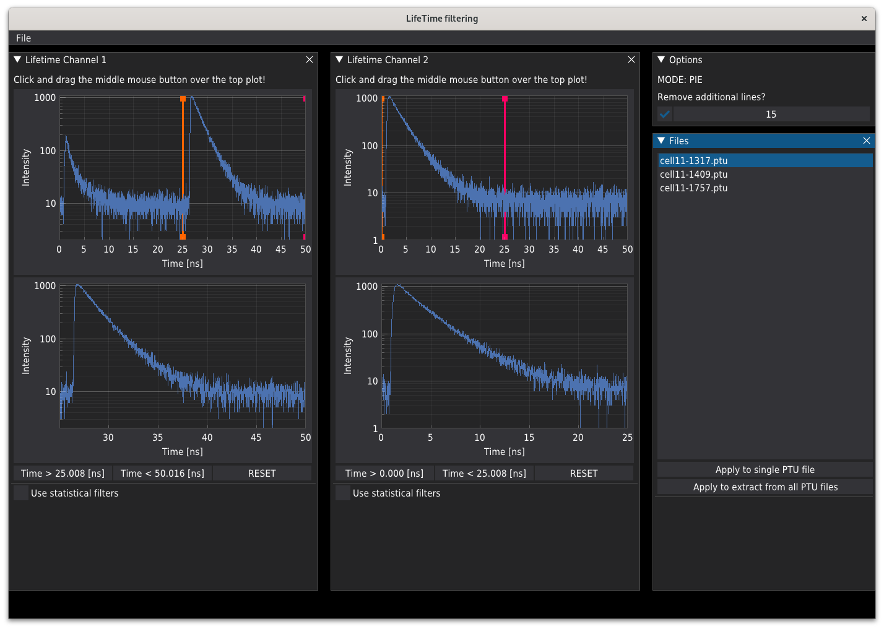    
    
Only the signal corresponding to the lower plots will be used for analysis.   

#### Important
Some older hardware based on NIKON A1 and LSM upgrade kits from PicoQuant may experience a hardware bug occurring during the crosstalk between the A1 controller and the SymPhoTime software for the _.ptu_ files acquisition. The bug occurs as additional lines in the figure are collected by SymPhoTime, resulting in a seared-like image at the top of the picture. The panel displayed below, located at the top right corner of the main window, allows you to make a correction for the additional lines.    

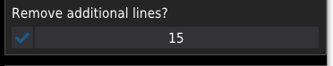    

#### Apply filtering and extract 
The panel displayed below shows the files located in the analyzed folder. To analyze a single file, press "Apply to single PTU file". Pressing "Apply to extract from all PTU files" applies the selected analysis procedure (time gates or statistical filters) to all files from the list.    

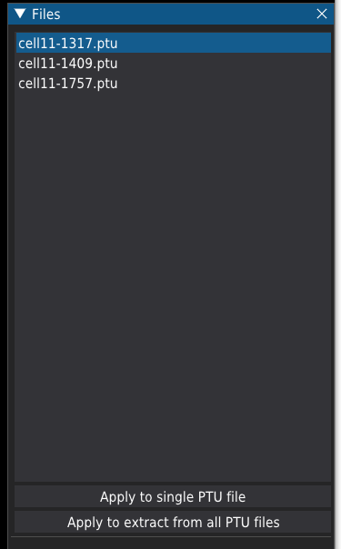     

#### Statistical filters
Checking the "use Statistical filters checkbox under each channel deactivates draglines and activates the "Calculate filters" button. This button opens the window (see below) where you can calculate statistical filters for background or fluorescence decay patterns imported from the library.     

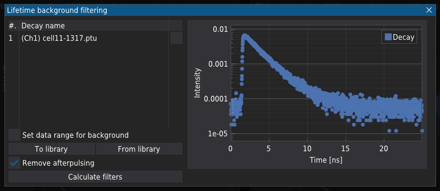     
    
##### Removing background and afterpulsing  
On the left of the above window, there is a list of decay patterns. Initially, only one pattern corresponds to the one extracted from the image at a given channel and is displayed in the plot.    
Selecting the "Set data range for background" checkbox activates draglines, allowing one to select the background region of the pattern, usually the plateau at the highest times of the decay pattern. Based on the selected region, the mean value of the background signal is calculated and subtracted from the original decay data. This subtracted data can be further used for calculation of the statistical filter or stored in the library by pressing "To library"; [procedure will be described later](#to-library).    
Pressing the "Calculate filters" button will calculate the proper weights according to the procedure described in the literature.[1](#ref_1), [2](#ref_2) After that a new plot will appear. On the plot, one can see all the weights calculated for the curves in the left table, together with the background and afterpulsing signal. The values of weights are in the range from 0 to 1. To accept the current set of weights, press "Accept"; to reject and recalculate, press "Decline".    

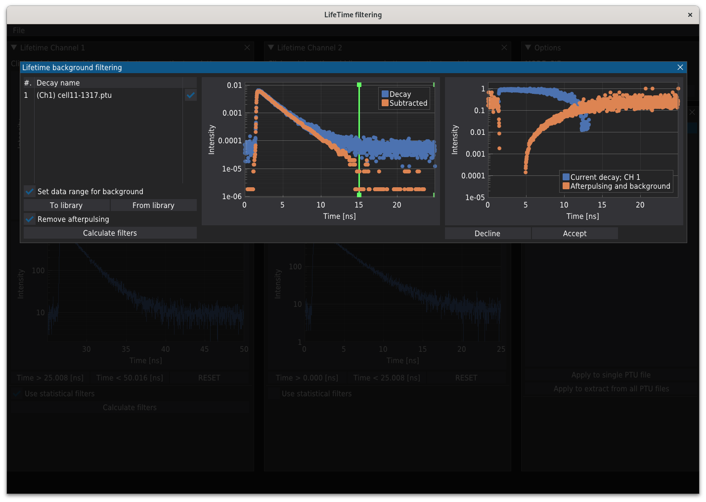     

##### Export the decay pattern to library 
Instead of filter calculation, one can store the given decay pattern in the library for further use. For this purpose, instead of "Calculate filters," press "To library".     

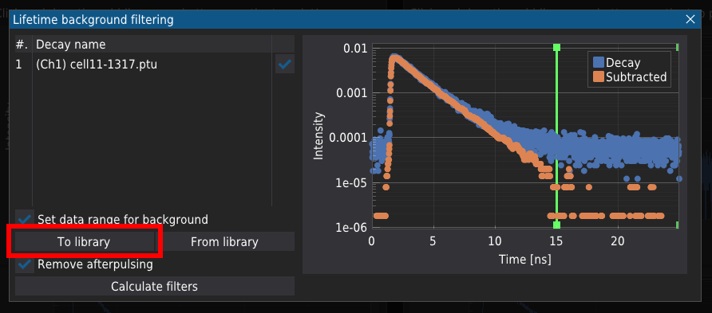     

Below The "Calculate filters" button, you will see the new fields required to store the data.     

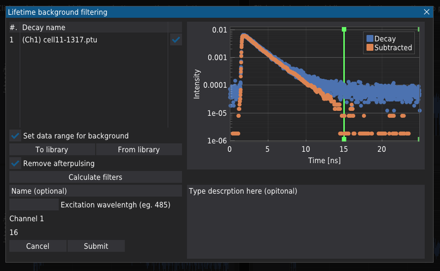     

Although some fields are optional, the more details you provide, the easier you will find the proper decay. To store the data, press "Submit".

##### Import the decay pattern from library 
You can import stored decay data by pressing the "Form library" button.    

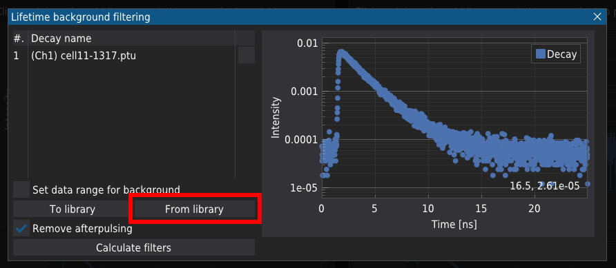     

Below the "Calculate filters" button, you will see the table containing all the stored decay patterns. Marking the dacay and pressing "Import" will load the dacay pattern.    

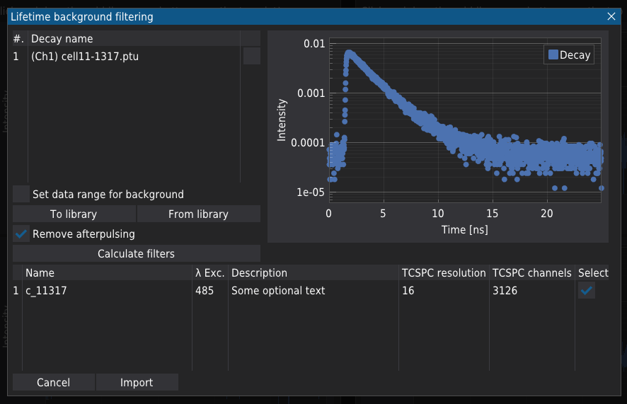     

Note you can select many decay patterns, but they do not need to be physically justified.

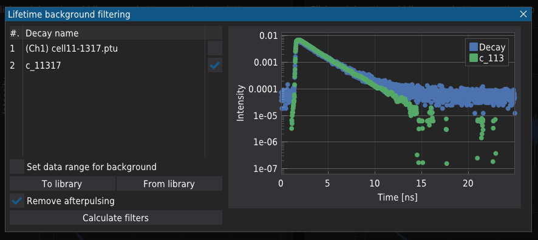     

You may also want to subtract the background (see [above](#remove-background)). Pressing "Calculate filters" will open the plot with calculated weights. Note the calculations can take some time. When you select many patterns, you should be sure which weight you would like to use for further analysis.
Assuming that we are interested in detecting only the photons that originate from the imported decay here noted as _c_11317_, for further analysis, you will use the weight of the same name.

  

#### Filtering

Pressing the "Accept" button will close the window, and you can select the weights for analysis.

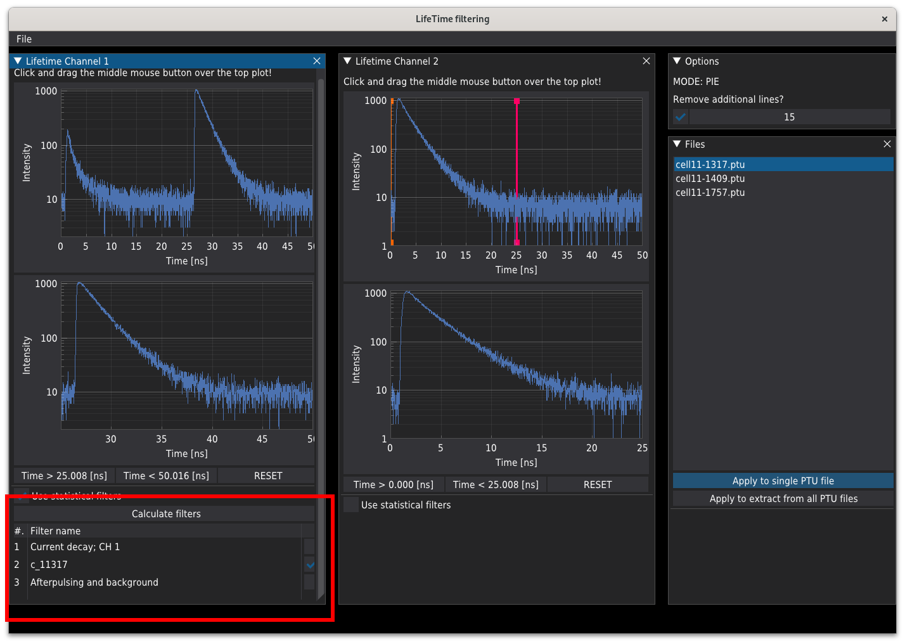     

The same procedure can be repeated for Channel 2. Next, you can [apply](#apply-procedure) the filtering to the data.

### OUTPUT
As an output, for each _.ptu_ file, the script will generate several files required for further procedure steps.
Assume that the name of your file is _some-file.ptu_. The script will generate:   
_some-file.info_  - the JSON file containing information about the measurement, including the image's resolution, pixel size, number of frames in the _.ptu_ file, the dwell time per pixel, and the time resolution of the fluorescent decay.    
_some-file_ch_1.csv_  - the matrix containing the number of photons registered in each pixel of the unfiltered image (Channel 1),    
_some-file_ch_2.csv_  - the matrix containing the number of photons registered in each pixel of the unfiltered image (Channel 2),    
_some-file_ch_1.pck_  - the matrix containing the number of photons registered in each pixel of the unfiltered image (Channel 1) stored in the pandas pickle file,    
_some-file_ch_2.pck_  - the matrix containing the number of photons registered in each pixel of the unfiltered image (Channel 2) stored in the pandas pickle file,    
_some-file_ch_1.png_  - the bitmap for Channel 1,    
_some-file_ch_2.png_  - the bitmap for Channel 2,    
_some-file_ch_1_FC.png_  - the bitmap for Channel 1 displayed in false colors,    
_some-file_ch_2_FC.png_  - the bitmap for Channel 2 displayed in false colors,    
_some-file_INT_ch_1.npy_  - the numpy array for intensity values (filtered) per pixel; Channel 1,    
_some-file_INT_ch_2.npy_  - the numpy array for intensity values (filtered) per pixel; Channel 2,    
_some-file_LT_ch_1.npy_  - the numpy array for fluorescence lifetime values (filtered) per pixel; Channel 1,    
_some-file_LT_ch_2.npy_  - the numpy array for fluorescence lifetime values (filtered) per pixel; Channel 2,    
_some-file_taus_ch_1.pck_  - the decay pattern for Channel 1 stored in the form of pandas pickle,    
_some-file_taus_ch_2.pck_  - the decay pattern for Channel 2 is stored as a pandas pickle.    

## References
[1] Enderlein, Jörg, and Ingo Gregor. "[Using fluorescence lifetime for discriminating detector afterpulsing in fluorescence-correlation spectroscopy](https://doi.org/10.1063/1.1863399)." Review of scientific instruments 76.3 (2005).     
[2] Kapusta, Peter, et al. "[Fluorescence lifetime correlation spectroscopy](https://doi.org/10.1007/s10895-006-0145-1)." Journal of Fluorescence 17 (2007): 43-48.
