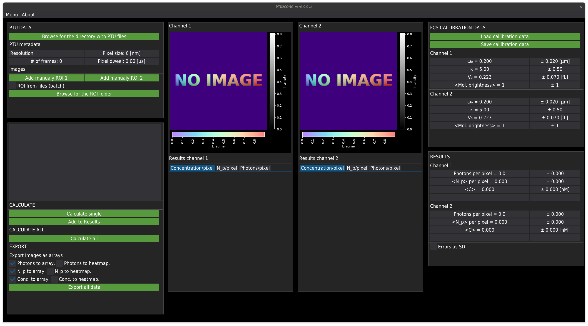
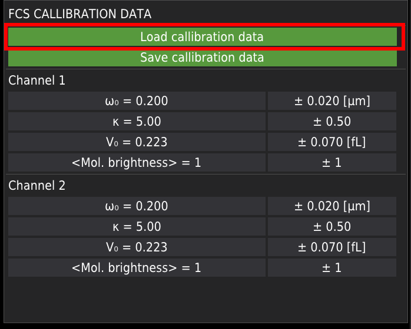
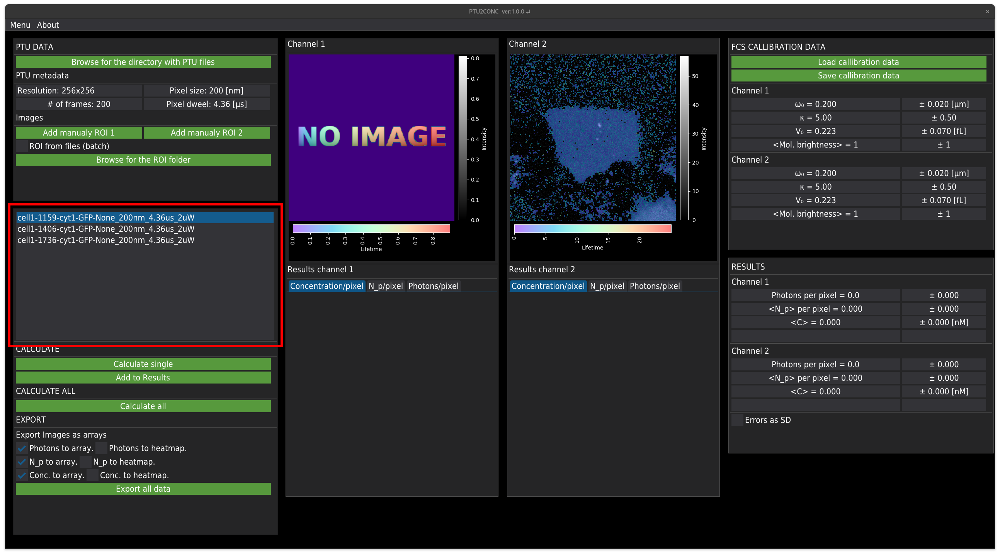
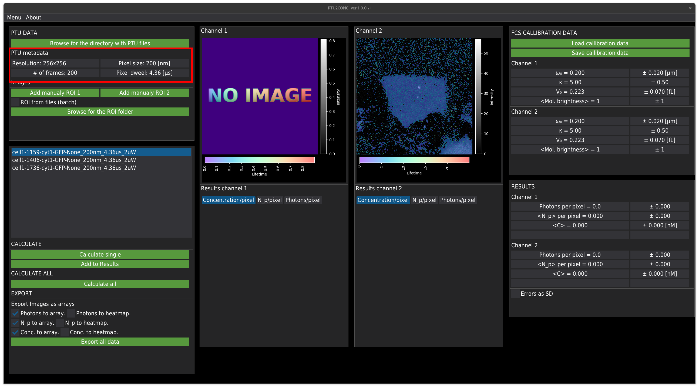
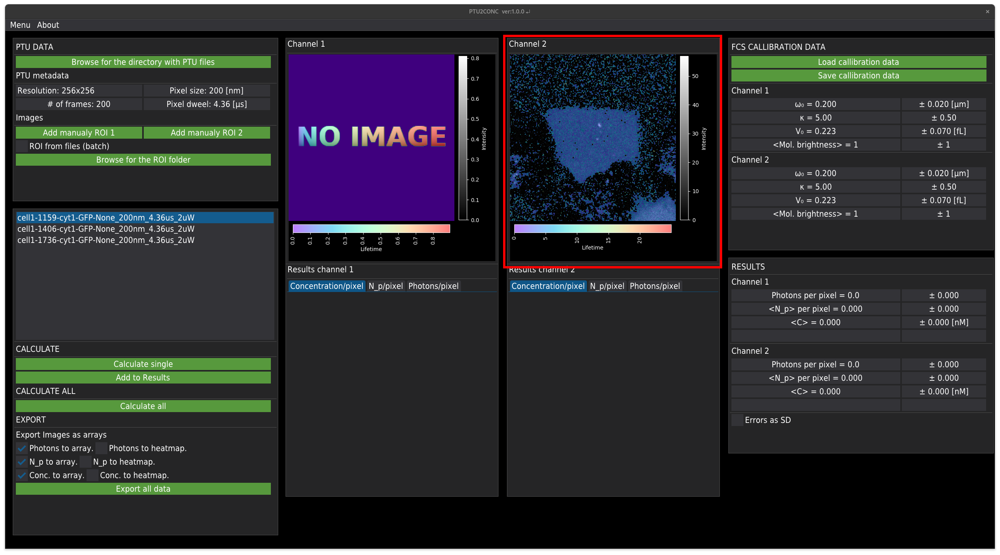
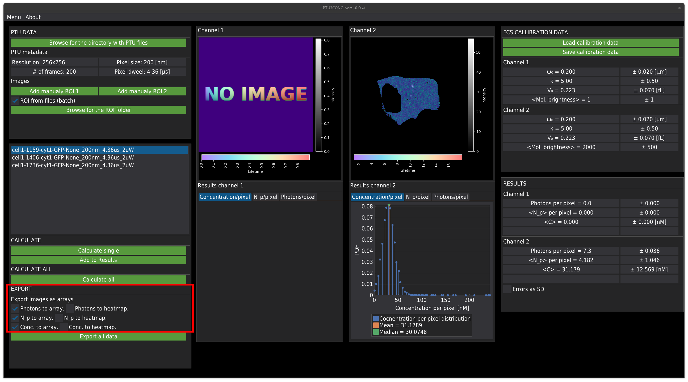
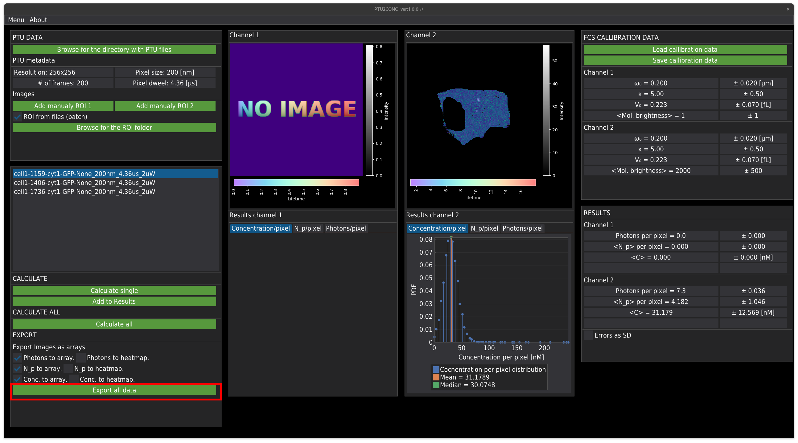

# PTU2CONC
Software for analysis of the concentration of fluorescent molecules inside living cells from single-molecule FLIM imaging data.
The script can read the files created with the _EXTRACT_FROM_PTU_FLIM.py_ script containing the data extracted from the _.ptu_ files. __Note _PTU2CONC_ script does not read the _.ptu_ files directly. It is necessary to use _EXTRACT_FROM_PTU_FLIM.py_ first!__

## HOW TO USE

1. To run the script, type in the command line:

            python PTU2CONC.py    

    It will start the graphical interface that will help to navigate through the process,    
        
    
2. At the very beginning, we suggest inputting the calibration values either from the file    

        
    
    or manually.    
    
        
    
    __Note. When you load the file, it needs to have a proper structure.__ For more details check the Calliberation_exmaple files (_.json_) in the smaples folder.    
3. Browse for the folder containing the _.ptu_ files (should be the same folder where the output files of the _EXTRACT_FROM_PTU_FLIM.py_ script were created).   

        
    
    This will load all data stored in the given folder. __Note. The folder should contain only _.ptu_ files and those created by the _EXTRACT_FROM_PTU_FLIM.py_ script. Other files can break the script!__    
    
    When the data are loaded, the list of files will appear:    
    
        
    
    The metadata of each file is shown in the _PTU metadata_ panel:    
    
        
    
    The image from each channel is shown in the corresponding windows:    
    
        
    
    In this example, the file contains data only for Channel 2.    
    
4. You may wish to limit the image analysis to a given region of interest (created in the SymPhoTime software or in ImageJ and rewritten with the _REWRITE_ROI.py_ script). For this purpose, press the 'Browse for the ROI folder' button:    

        
    
    Resulting in cutting off unwanted image areas,    
    
       
    
5. To analyze the images and calculate concentrations for a single image, press 'Calculate single',    

       
    
    The result will be displayed in these tables:   
    
       
    
    and presented in the form of concentration, N_p, or photon distribution:
    
       
      
6. Press 'Add to results' to store the results in the memory.    
    
       
    
7. Alternatively, one can perform automatic analysis for all listed files by pressing 'Calculate all':    

       
    
    In this mode, results will be stored automatically in the memory.
8. During calculation, the data will be automatically exported according to rules marked in the export panel.   
    
        
    
    "to array" means that it will create the file containing the array (size of the image) containing a number of photons, molecules, or concentration in a given pixel.    
    "to heatmap" means that the heatmap will be exported as the _.png_ file.   

9. To export the averaged data as a table, press the "Export all data" button.

        
    
    
    
