# smICA - single-molecule Image to Concentration Analyser
This repository provides software for calculating fluorophore concentrations from FLIM images stored in the PTU format (PicoQuant, Germany).   

## About
The Software allows the extraction of information about registered photons from the _.ptu_ file, filtering them using statistical filters based on fluorescence decay time and autodetection of the region of interest (ROI), and finally creating a map of the absolute concentration of the fluorophore.

## List of changes (v2.0.0)

1. Integration of the previously separate scripts (_EXTRACT_AND_FILTER_PTU_ and _Phot2Conc_) into a single unified script. At startup, the user can select the operation mode (EXTRACT from PTU and FILTER or Phot2Conc).
2. The _REWRITE_ROI_ script remains available, allowing users to load externally generated ROI files (text image format). As external ROI files are not essential for the standard analysis workflow, the script is located in the _src_ directory. After installation, the _REWRITE_ROI_ script is available in the _smICA_ folder within the installation path.
3. Complete refactoring and codebase cleanup.
4. In the Phot2Conc mode, an automatic ROI feature was added, enabling:
    - automatic cell detection,
    - nucleus exclusion from detected cells,
    - copying ROIs between channels.
5. Support for multiple external ROI files.
6. Minor graphical improvements and overall code stability enhancements.
7. Automatic update availability checking.
8. Installation setup added for:
   - Linux (tested on Fedora 40),
   - Windows (tested on Windows 10 and 11).

## Installation guide

1. Currently, the scripts work and install properly on 3.6 >= Python <= 3.12.
2. Run the installation script:

    1. On Linux, run the _install.sh_, shell script by typing:
   
       ./install.sh
       
    2. On Windows, double-click the _install_win.bat_ executable script. 
The installation can take a while as all required packages must be downloaded.
  

## User guide
The workflow for mapping the fluorophore's concentration in living cells can be divided into two to three steps, depending on the user's preferences. 
1. Extract the information about photons from the binary _.ptu_ file and filter the data to eliminate background or unwanted influence of autofluorescence or other fluorophores.
2. (OPTIONAL) Create the ROI file using external software, for example, ImageJ, to create a binary text image containing a selection of the pixels that should be included in the analysis. This step is optional because the third step offers automatic cell detection. A detailed description of using the _REWRITE_ROI_ script can be found in the _README_ file in the script's folder.
3. Calculate the map of the fluorophore concentration based on fluorescence intensity data and calibration data.

At the startup, the user can choose between two modes: [EXTRACT from PTU and FILTER](#EXTRACTandFILTER) or [Phot 2 Conc](#Phot2Conc).
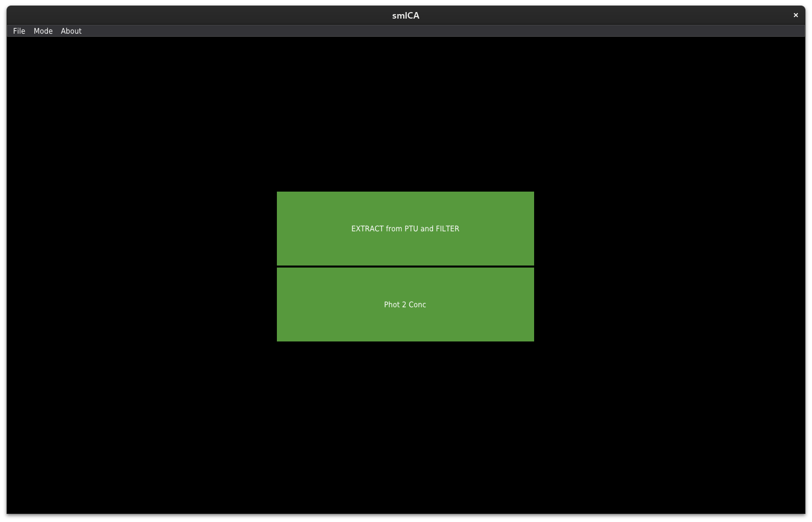
The first option is to extract raw data from the _.ptu_ files, filter the data using time gating, or apply statistical filters based on the fluorescence decay pattern. The second option provides a GUI for mapping the concentration of fluorescent molecules within living cells. Below is a detailed description of each mode.
You can also switch between modes by selecting the proper option from the Mode menu.

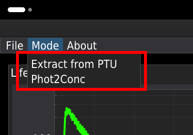

#### **EXTRACT from PTU and FILTER**

First, click "File" and "Open PTU directory" to select the folder storing your _.ptu_ files.   

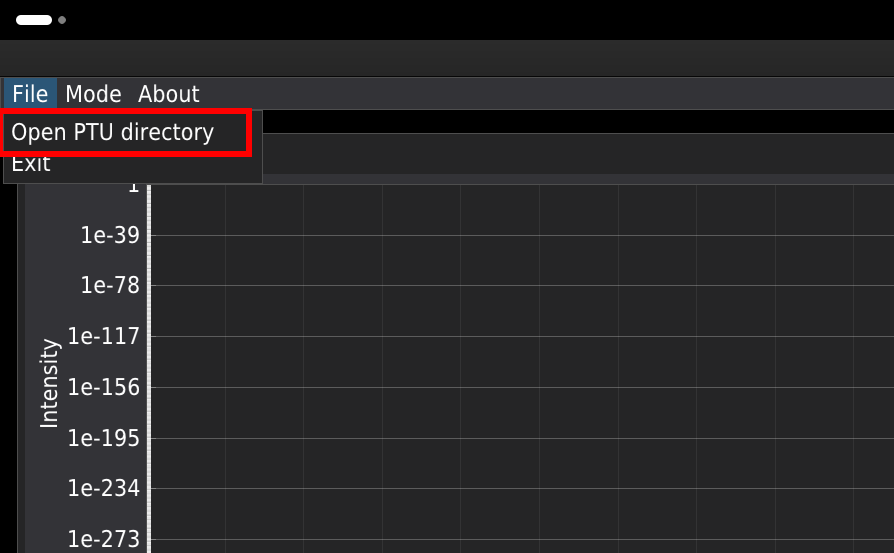

We suggest keeping the _.ptu_ files from different experiments in separate folders.    
The script recognises the measurement mode (standard or PIE). If two detectors are used in the measurement, the signal will be automatically split and displayed as Channel 1 and Channel 2. The lifetime analysis can be performed for each channel separately.     

Simple time gating can be realised by selecting the region of the fluorescence decay pattern by moving the orange and red drag lines displayed in the upper plots.

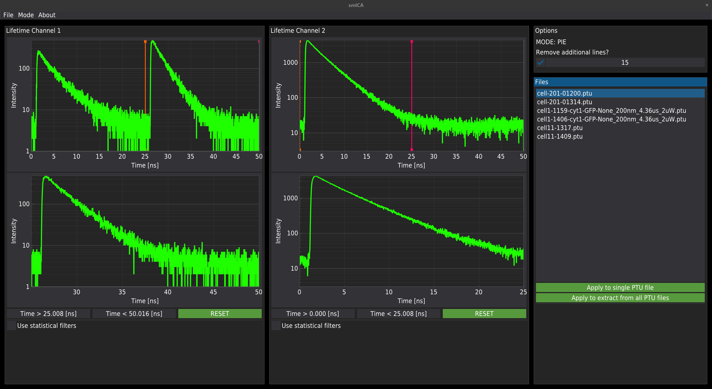  
Only the signal corresponding to the lower plots  will be used for analysis.    
**Important!** Some older hardware based on NIKON A1 and LSM upgrade kits from PicoQuant may experience a hardware communication bug between the A1 controller and the SymPhoTime software during _.ptu_ file acquisition. Due to a bug, additional lines are added to the figure generated by SymPhoTime, resulting in a seared-like image at the top of the picture. The panel displayed below, located in the top-right corner of the main window, allows you to correct the additional lines. 
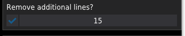   

##### **Apply filtering and extract** 
The panel displayed below shows the files located in the analysed folder. Press "Apply to single PTU file" to analyse a single file. Pressing "Apply to extract from all PTU files" applies the selected analysis procedure (time gates or statistical filters) to all files from the list.    

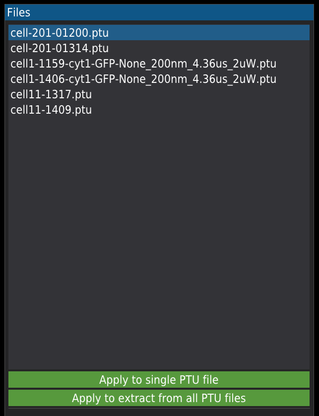

##### **Statistical filters**
Checking the "Use statistical filters" checkbox under each channel deactivates draglines and activates the "Calculate filters" button. This button opens the window (see below) where you can calculate statistical filters for background or fluorescence decay patterns imported from the library.     
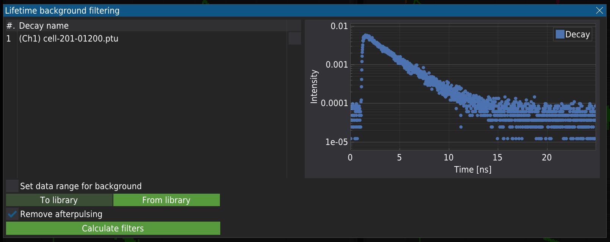  

##### **Removing background and afterpulsing**  
On the left of the above window is a list of decay patterns. Initially, only one pattern appears, corresponding to the pattern extracted from the image at a given channel; the one is displayed in the plot.    
Selecting the "Set data range for background" checkbox activates draglines, allowing one to select the background region of the pattern, usually the plateau at the highest times of the decay pattern. Based on the selected region, the background signal mean is calculated and subtracted from the original decay data. The subtracted data is further used for the calculation of the statistical filter or stored in the library by pressing "To library"; [procedure will be described later](#to-library).    
Pressing the "Calculate filters" button will calculate the proper weights according to the procedure described in the literature.[1](#ref_1), [2](#ref_2) After that a new plot will appear. On the plot, one can see all the weights calculated for the curves in the left table, together with the background and afterpulsing signal.  To accept the current set of weights, press "Accept"; to reject and recalculate, press "Decline".    

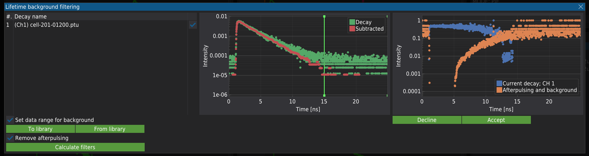   

##### **Export the decay pattern to library** 
Instead of performing a filter calculation, one can store the given decay pattern in the library for later use. For this purpose, instead of "Calculate filters," press "To library".     

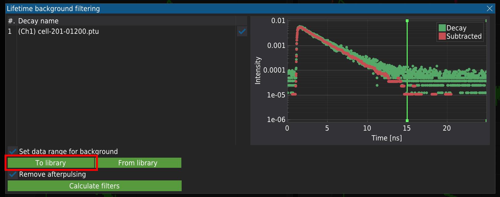     

Below the "Calculate filters" button, you will see the new fields required to store the data.     

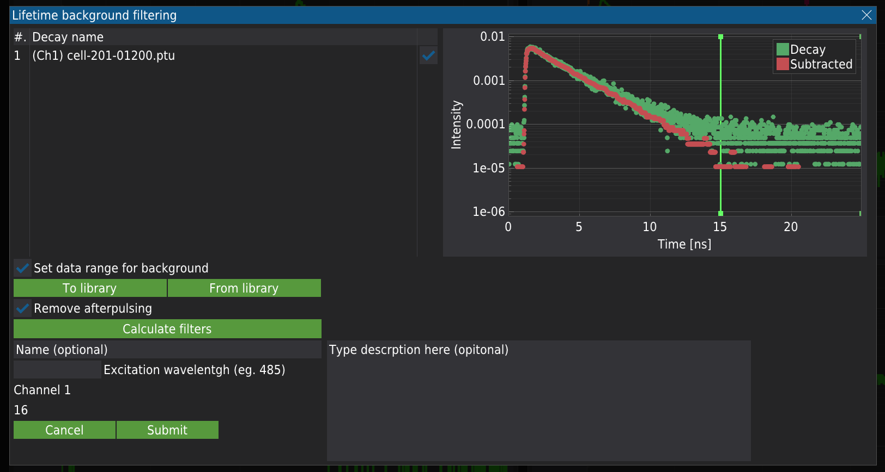     

Although some fields are optional, the more details you provide, the easier you will find the proper decay. To store the data, press "Submit".

##### **Import the decay pattern from library** 
You can import stored decay data by pressing the "Form library" button.    

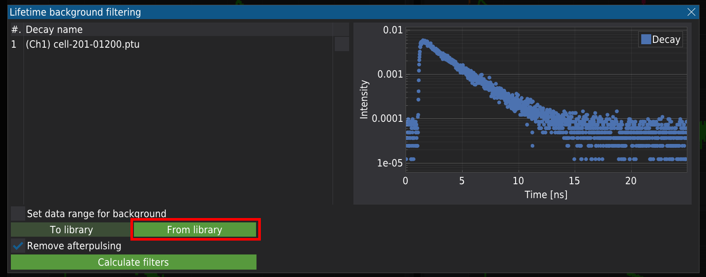     

Below the "Calculate filters" button, you will see the table containing all the stored decay patterns. Marking the decay and pressing "Import" will load the decay pattern.    

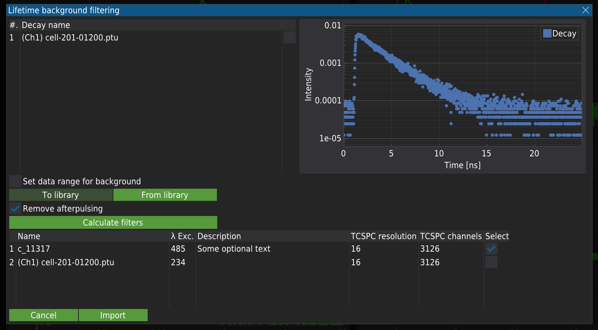     

Note, you can select many decay patterns, but they do not need to be physically justified.

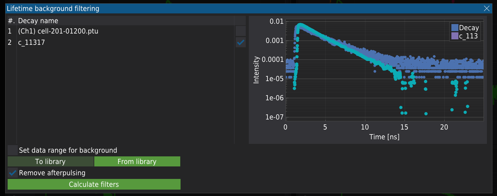     

You may also want to subtract the background (see [above](#remove-background)). Pressing "Calculate filters" opens the plot with the calculated weights. Note that the calculations can take some time. When selecting many patterns, be sure to specify the weight you would like to use for further analysis.
Assuming that we are interested in detecting only the photons that originate from the imported decay here noted as _c_11317_, for further analysis, you will use the weight of the same name.

##### **Filtering**

Pressing the "Accept" button will close the window, and you can select the weights for analysis.

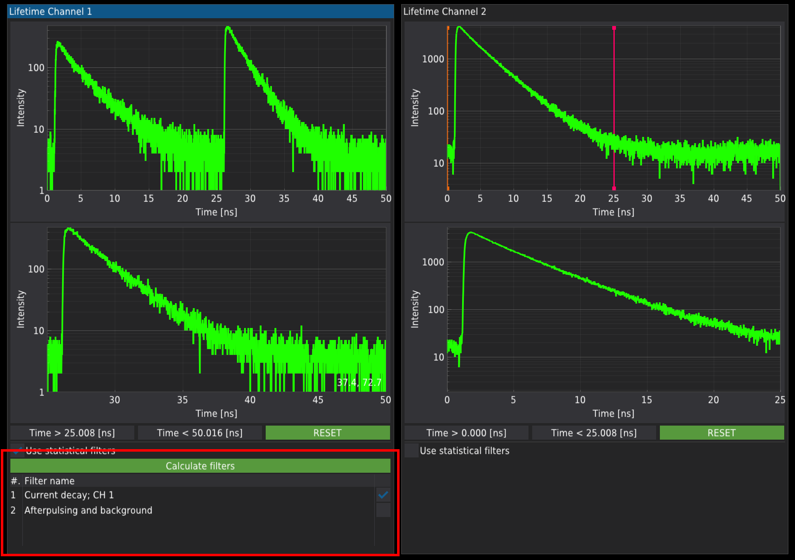     

The same procedure can be repeated for Channel 2. Next, you can [apply](#apply-procedure) the filtering to the data.

##### **OUTPUT**
As an output, the script will generate several files for the next procedure steps for each _ .ptu _ file.
Assuming that the name of your file is _some-file.ptu_. The script will generate:   
1. _some-file.pkl_  - The binary file containing experimental data. The file is necessary to generate the concentration map.   
2. Two _.png_ files per channel.

The _.pkl_ file is a pickle file containing the Python dictionary. The file structure is described in the table below.

|   Keys   | Value description                        |
|----------|------------------------------------------|
| File info| The Python dictionary containing: |
|          |  'L_file' : name of the _.ptu_file_                                       |
|          |  'Pixels per line': number of pixels in a line in the image                                       |
|          |  'Number of lines': number of lines in the image                                      |
|          |  'Pixels size': size of the single pixel (nm)                                      |
|          |  'Number of frames': number of frames acquired during the single measurement |
|          |  'Pixel dwell' : The time in $\mu$s that is spend to illuminate a single pixel |
|          |  'Lifetime resolution': The temporal resolution of the fluorescence decay (ns) |
| export_df_1| The pandas DataFrame containing the number of photons registered in channel 1 for each pixel  |
| export_df_2| The pandas DataFrame containing the number of photons registered in channel 1 for each pixel  |
| taus_1| The pandas DataFrame containing the TCSPC histogram registered in channel 1. The [time-gated](#lower-plots) signal|
| taus_2| The pandas DataFrame containing the TCSPC histogram registered in channel 2. The [time-gated](#lower-plots) signal|
| fulltaus_1| The pandas DataFrame containing the [full](#upper-plots) TCSPC histogram registered in channel 1. |
| fulltaus_2| The pandas DataFrame containing the [full](#upper-plots) TCSPC histogram registered in channel 2. |
| lifetimes_1| Numpy array containing the fluorescence lifetime for each pixel registered in channel 1. Signal after time-gating/filtration. |
| lifetimes_2| Numpy array containing the fluorescence lifetime for each pixel registered in channel 2. Signal after time-gating/filtration. |
| intensity_1| Numpy array containing the number of photons for each pixel registered in channel 1. Signal after time-gating/filtration. |
| intensity_2| Numpy array containing the number of photons for each pixel registered in channel 2. Signal after time-gating/filtration. |
| bgrnd_1| Numpy array containing the filtered background registered for channel 1. |
| bgrnd_2| Numpy array containing the filtered background registered for channel 2. |
| filter_weight_1| Numpy array containing the weights for each TCSPC channel calculated for channel 1. |
| filter_weight_2| Numpy array containing the weights for each TCSPC channel calculated for channel 2. |
| filter_afterpulsing_weight_1| Numpy array containing the weights for each TCSPC channel calculated for the background for channel 1. |
| filter_afterpulsing_weight_2| Numpy array containing the weights for each TCSPC channel calculated for the background for channel 2. |
| special_markers_1| Pandas dataframe containing full TCSPC information for both channels. |
| special_markers_2| Duplicated from special_markers_1|
| filtered_taus_1 | Pandas dataframe containing the TVSPC histogram after the TCSPC filtration procedure for channel 2. |
| filtered_taus_1 | Pandas dataframe containing the TVSPC histogram after the TCSPC filtration procedure for channel 2. |
The minimal Python script to get the pickled data is below.

        import os
        import pickle
        import pandas as pd
        import numpy as np
        path = '<path-to-file>/<file-name>.pkl'

        with open(path, 'rb') as file:
            pkl = pickle.load(file)

        file_info = pkl['File info']
        print(file_info)

        DF_1 = pkl['export_df_1']
        DF_2 = pkl['export_df_2']
        print(DF_1)
        print(DF_2)

        DF_taus_1 = pkl['taus_1']
        DF_taus_2 = pkl['taus_2']
        
        print(DF_taus_1)
        print(DF_taus_2)
        
        DF_ftaus_1 = pkl['fulltaus_1']
        DF_ftaus_2 = pkl['fulltaus_2']
        
        print(DF_ftaus_1)
        print(DF_ftaus_2)
        
        lifetimes_1 = pkl['lifetimes_1']
        lifetimes_2 = pkl['lifetimes_2']
        
        print(lifetimes_1)
        print(lifetimes_2)
        
        intensity_1 = pkl['intensity_1']
        intensity_2 = pkl['intensity_2']
        
        print(intensity_1)
        print(intensity_2)

        bgrnd_1 = pkl['bgrnd_1']
        bgrnd_2 = pkl['bgrnd_2']
        
        print(bgrnd_1)
        print(bgrnd_2)

        filter_weight_1 = pkl['filter_weight_1']
        filter_weight_2 = pkl['filter_weight_2']
        
        print(filter_weight_1)
        print(filter_weight_2)

        filter_afterpulsing_weight_1 = pkl['filter_afterpulsing_weight_1']
        filter_afterpulsing_weight_2 = pkl['filter_afterpulsing_weight_2']
        
        print(filter_afterpulsing_weight_1)
        print(filter_afterpulsing_weight_2)

        special_markers_1 = pkl['special_markers_1']
        special_markers_2 = pkl['special_markers_2']
        
        print(special_markers_1)
        print(special_markers_2)

        filtered_taus_1 = pkl['filtered_taus_1']
        filtered_taus_2 = pkl['filtered_taus_2']
        
        print(filtered_taus_1)
        print(filtered_taus_2)

#### **Phot 2 Conc** 

This mode allows for mapping the concentration of fluorescent molecules using single-molecule FLIM imaging data.
The script requires the _.pkl_ files created in the [EXTRACT from PTU and FILTER](#EXTRACTandFILTER) mode. __Important! This script does not read the _.ptu_ files directly. It is necessary to use the [EXTRACT from PTU and FILTER](#EXTRACTandFILTER) mode first!__

The GUI is divided into several sections.
1. PTU metadata containing the information about image acquisition.
2. ROI containing the selection panel for choosing the method for the region of interest. It also allows control of the automatic ROI [see below](#autoroi).
3. The list of files for analysis that are located in the PTU folder.
4. Buttons starting the calculations and export options.
5. Analysed image - 5' for channel 1 and 5'' for channel 2.
6. Histograms of the concentration number of molecules or number of photons per pixel - 6' for channel 1 and 6'' for channel 2.
7. The FCS calibration data
8. Mean results.
   
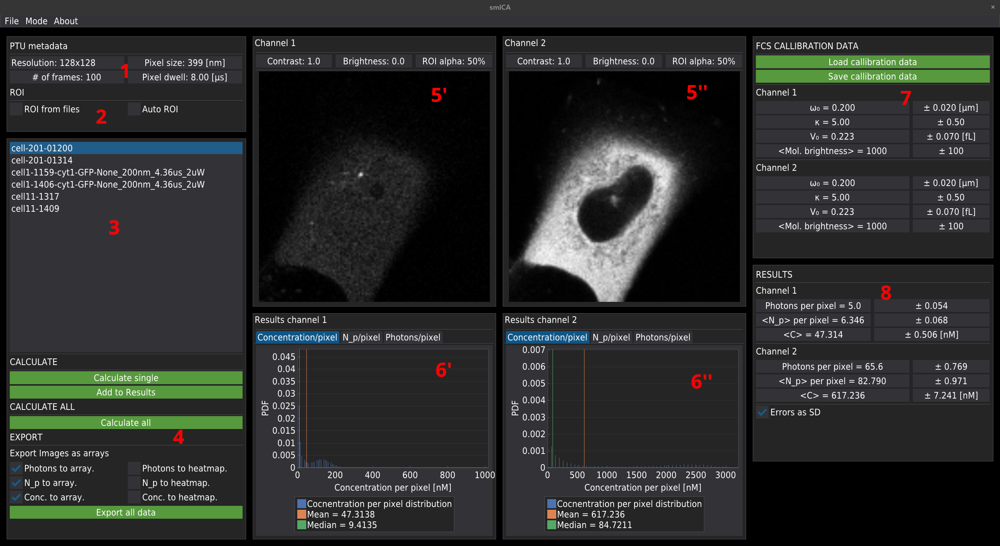 

##### **Loading files and callibration data**

The folder containing files for analysis can be selected by using the File menu.
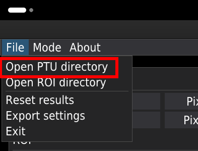

__Note.__ The folder should contain only _.ptu_ files and the corresponding _.pkl_ files.  

After loading the list of files, it is recommended to load or input the FCS calibration data and molecular brightness of the fluorophore required for proper calculation of the number of molecules and concentration.
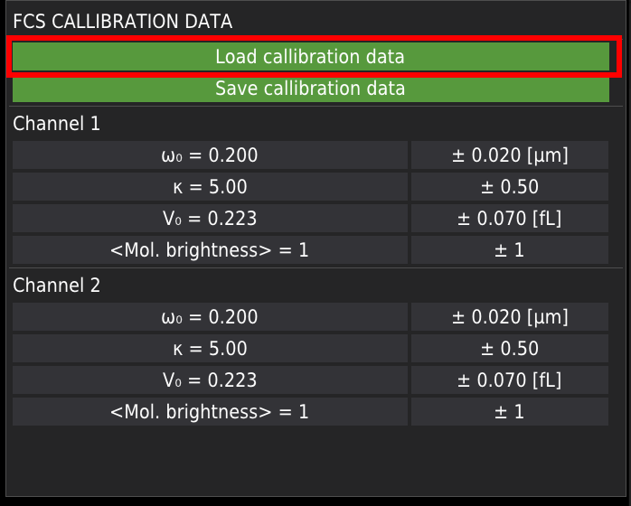
    
or manually.    
    
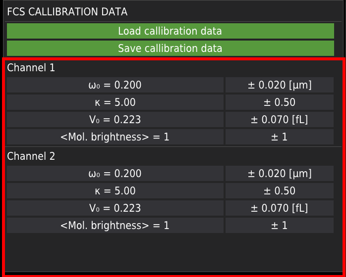
    
__Note. When you load the file, it needs to have a proper structure.__ For more details check the Calliberation_exmaple files (_.json_) in the smaples folder.
   The calibration values provided manually can be saved by pressing the save button

   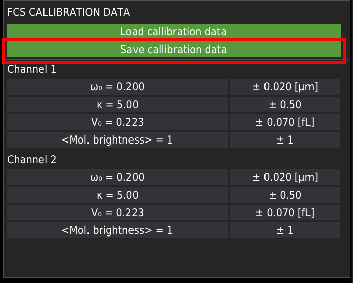

The analysed image is displayed in windows corresponding to channel 1, 2 or both.
Above the images, the user can adjust the visibility of the images by changing contrast and brightness, or the overlaying ROI's alpha channel; [see ROI section](#ROI). 
   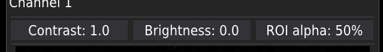
**The adjustment** is applied only to the displayed image (channel 1 or channel 2) and **does not affect the results**.

##### **Selecting the ROI**
The region of interest is a part of the image that will be considered during the image analysis. It is marked in red on the image. The software has two options for ROI definition: "ROI from files" or "Auto ROI".    

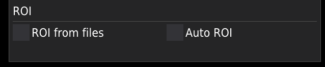    

The "ROI from files" option requires externally created roi files. Examples of externally generated ROI files (generated with ImageJ) are in the samples/ROI folder. The files should be rewritten with the _REWRITE_ROI.py_   [script](#REWRITEROI) before import. Note that (i) each channel's ROI file is created separately. (ii) the filename of the ROI file should have the same structure as the PTU file with an additional string at the end of the filename, according to the example given below.    
_file_name.ptu_    
_file_name_roi0_ch_1.dat_ - (ROI file for channel 1)    
_file_name_roi0_ch_2.dat_ - (ROI file for channel 2)    
The ROI files will automatically load the given _.ptu_ file. To import the ROI files, the user must specify the folder containing the files by selecting the path using the "Open ROI directory" option from the File menu. It is possible to have many ROI files per _.ptu_ file. The multiple ROI files are identified by numeration in the _roiX_ part of the ROI's file name.    

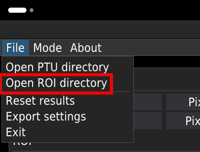

The second option for selecting the region of interest is the automatic mode. Selecting the Auto ROI checkbox displays the ROI control panel for both channels, and the ROI on the image as a red field.    

 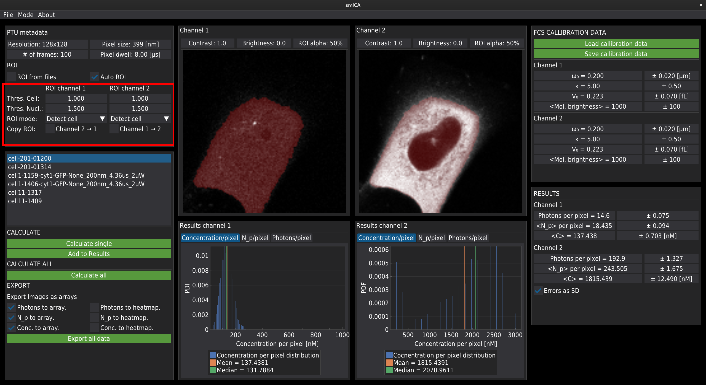

At this moment, the automatic ROI option offers: automatic detection of a single cell, automatic detection of more than one cell and selection of the ROI of interest (clicking on the image), copying ROI between channels, finding dark or bright areas, subtracting dark or bright areas, and finding and subtracting many bright spots. All modes use the OTSU thresholding method. The user can independently adjust the original OTSU threshold by changing the corresponding sliders in each channel.

ROI copying between channels is performed only in the "detect cell" mode. Note that when the checkbox is selected, the thresholding levels can be regulated only in the original channel. For example, selecting "Channel 1->2" will copy the ROI from channel 1 to channel 2. 

##### **Calculate results**

To correctly calculate concentration maps, the user must provide or import calibration data obtained from FCS measurements, including the focal volume width $\omega_0$, the structure parameter $\kappa$, and the mean molecular brightness [see above](#loadingfiles). 
Pressing "Calculate single" will display the results for a single file. Press the "Add to results" button to store the results and remember the Auto ROI settings for a given file. The calculate all button will automatically calculate and store the data for all files, one by one.
 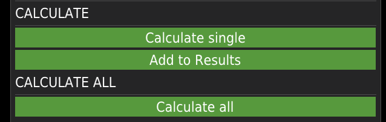

The result will be displayed in these tables:   

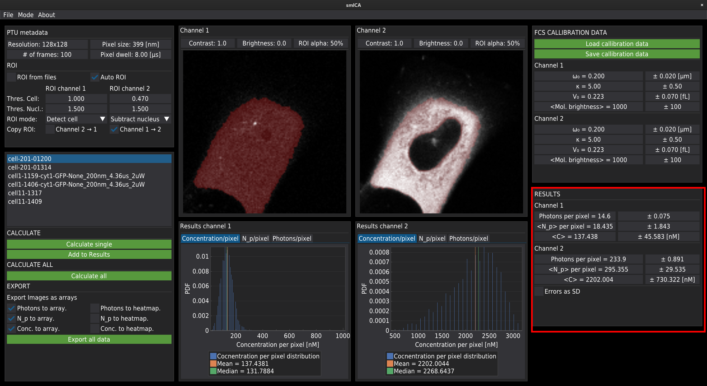

and presented in the form of concentration, N_p, or photon distribution:

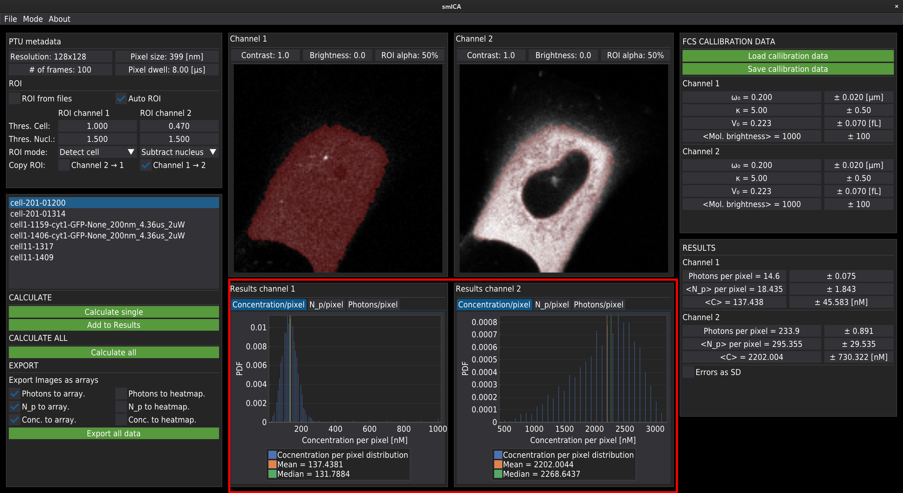

The errors displayed in the RESULTS window can be calculated in two ways. The checkbox _Errors as SEM_ switch changes between them:

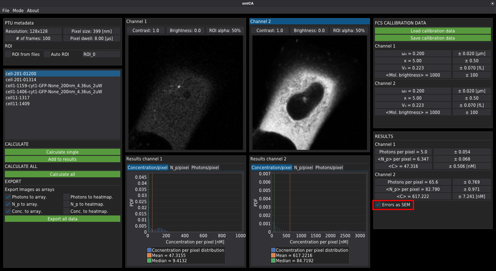
       
   In the first case (unmarked checkbox), the error is returned as the mean of the maximum errors calculated for each pixel. Those errors include errors for $V_0$ and the molecular brightness.

   The second error calculation method (marked checkbox) returns the standard error of the mean, calculated as the standard deviation $SD$ over all pixels, divided by the square root of the number of pixels.

##### **Export results**

During calculation, the data will be automatically exported according to the rules marked in the export panel.   
    
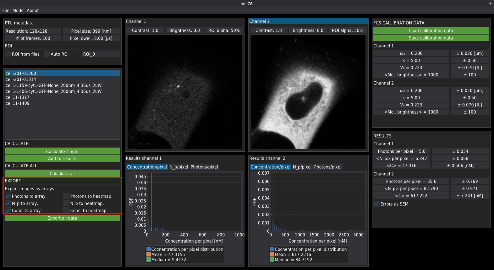

"to array" means that it will create a file containing the array (size of the image) containing a number of photons, molecules, or concentration in a given pixel.    
"to heatmap" means that the heatmap will be exported as the _.png_ file.   

To export the averaged data as a table, press the "Export all data" button.

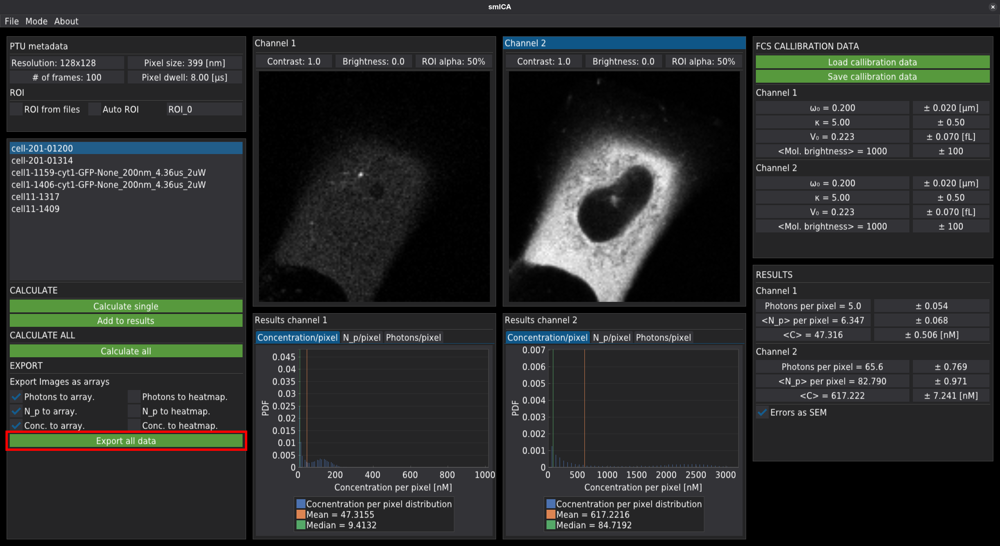

## References
[1] Enderlein, Jörg, and Ingo Gregor. "[Using fluorescence lifetime for discriminating detector afterpulsing in fluorescence-correlation spectroscopy](https://doi.org/10.1063/1.1863399)." Review of scientific instruments 76.3 (2005).     
[2] Kapusta, Peter, et al. "[Fluorescence lifetime correlation spectroscopy](https://doi.org/10.1007/s10895-006-0145-1)." Journal of Fluorescence 17 (2007): 43-48.

### Acknowledgement
This work was funded by the Polish Science Fund within the framework of the Virtual Research Institute; grant WIB-1/2020-O11 - WIB_HERO.
