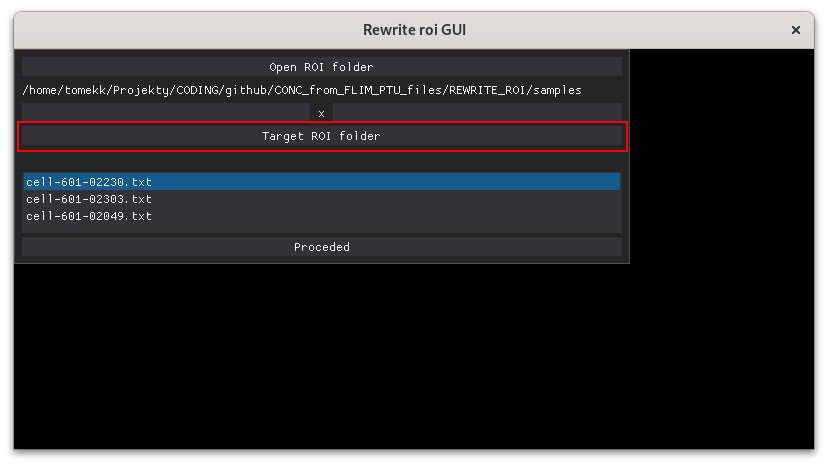

# REWRITE_ROI_GUI
This script runs GUI for the script, rewriting the ROI files from the format created with ImageJ into the format readable by the scripts in the PTU2CONC folder.

## HOW TO USE
### Preparation of the ROI files
1. Start ImageJ or Fiji
2. Open a png file obtained with the _EXTRACT_FROM_PTU_FLIM.py_ script, either black/whiet or false-colors; see the OUTPUT section of the _README.md_ file for the _EXTRACT_FROM_PTU_FLIM.py_ script.
3. Make a selection around the region of interest,
4. In the Edit menu, select _Clear Outside_,
5. In the Edit menu, select _Fill_,
6. Save the image as _Text Image_.

### Using REWRITE_ROI_GUI.py
1. To run the script, type in the command line:

        python REWRITE_ROI_GUI.py    

    It will start the graphical interface that will help to navigate through the process,    
    
2. Press the "Open ROI folder" button to open a dialog window where you can select the folder containing ROI files obtained from ImageJ. The ROI files must be saved as _.txt_ files,    
    

3. Below the button, the path to the folder will appear,
        
    Also, the list of files will be created:
         
4. Next, input the resolution of the image (256 x 256)
         
5. Press the "Target ROI folder" button to open a dialog window where you can select the folder where rewritten ROI files will be created,     
         
    Below the button, the path to the folder will appear,     
         
6. Press the "Proceed" button to start the rewriting,
         
7. The end of the process will be signalized with a pop-up window.    
     
